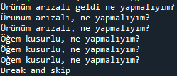
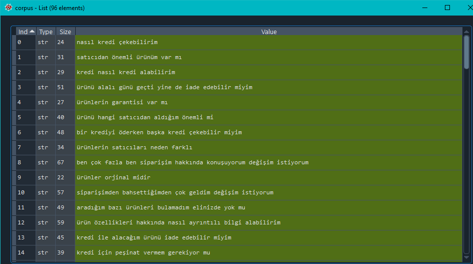
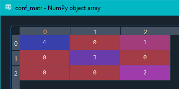
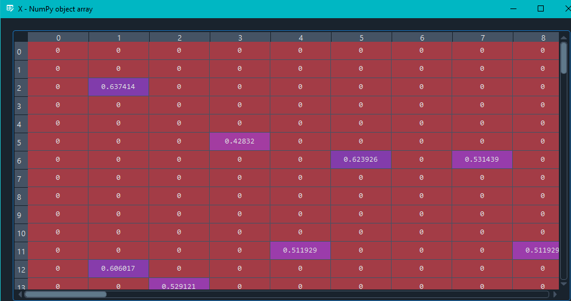
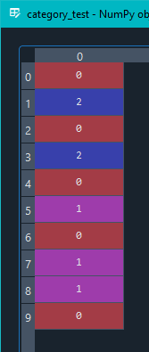
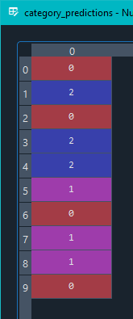
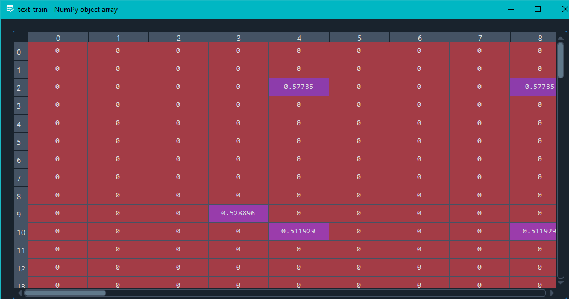
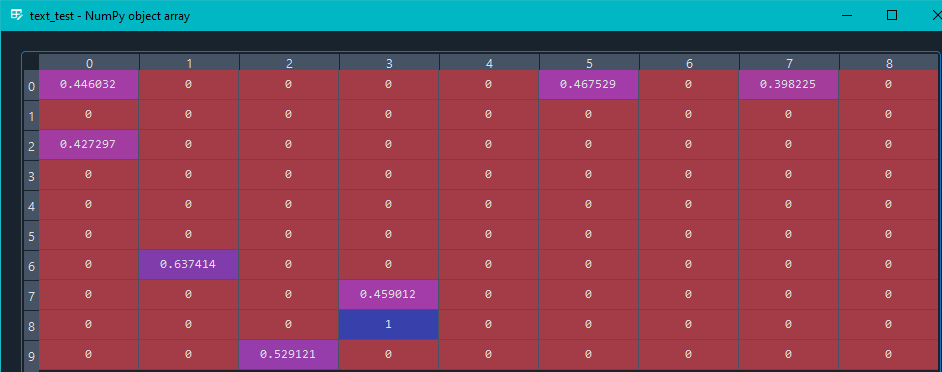

# text-classification
A Python text classification program uses Tf/Idf model and Logistic Regression

## Text Generation
There are sentences and their categories stored in a two dimensional matrix named examples. With [Google Trans API](https://pypi.org/project/googletrans/), program automatically generates new sentences; first it translates the example sentence to English then translates it back to Turkish and if there is a difference in between two sentences it stores the new one and continues until it generates the same sentence and then stops and passes to the next example.

## Training and Predicting
After generation it'll have enough training data to go. There are only 100 sentences but still I dumped the data with [Pickle](https://docs.python.org/3/library/pickle.html) for to make program faster with big data. Program first creates a bow (bag of words) model than transforms it to a Tf/Idf model. After that it splits the data for training and testing (10% test - 90% train).
With Logistic Regression classifier it uses the training data for learning and then predicts the test data. After that it compares the predictions with actual categories and shows the result in a confusion matrix. Program provides 90% accuracy with only 90 training data, if better trained the results will be better.

#### Confusion Matrix

#### Vectorized Corpus

#### Categories - Test data and prediction data

#### Sentences - Training data and test data

